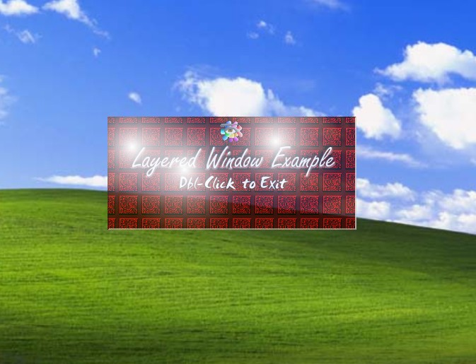



## Using 32pp GDI Bitmaps and UpdateLayeredWindow from Visual Basic

### Description

This article has a two-fold purpose; One to show you an example of using the UpdateLayeredWindow function from Visual Basic. The other is to give you an example of using 32bpp bitmaps via the Windows GDI, which allows you to use per-pixel alpha blending for eye-catching effects..

This sample is based around a simple non-moveable form, that is semi-transparent (that is, you can see the windows desktop behind it). Go on, download, and browse through the code to get an understanding of the concepts presented. Hope you guys (and Gals) like it. Once again I must give all thanks to God my Father for guiding me throughout the entire development. Oh well, later.
 
### More Info
 
Remember, this code will only work under Windows 2000, and higher, although the code used to generate the 32bit bitmaps and perform alpha blending will also work under Windows 98.

BTW. You may want to compile the application before running it, in order to obtain a speed increate (but I'm sure you already knew that :) )

             |
---                |---
**Submitted On**   |2004-03-24 13:44:48
**By**             |[Xael](https://github.com/Planet-Source-Code/PSCIndex/blob/master/ByAuthor/xael.md)
**Level**          |Intermediate
**User Rating**    |5.0 (30 globes from 6 users)
**Compatibility**  |VB 6\.0
**Category**       |[Graphics](https://github.com/Planet-Source-Code/PSCIndex/blob/master/ByCategory/graphics__1-46.md)
**World**          |[Visual Basic](https://github.com/Planet-Source-Code/PSCIndex/blob/master/ByWorld/visual-basic.md)
**Archive File**   |[Using\_32pp1724133242004\.zip](https://github.com/Planet-Source-Code/xael-using-32pp-gdi-bitmaps-and-updatelayeredwindow-from-visual-basic__1-52629/archive/master.zip)

